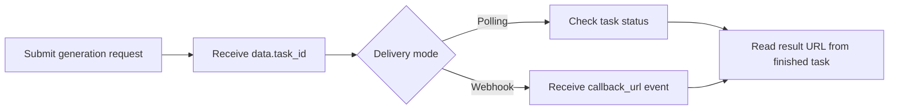

# Seedream 5.0 Lite API with APIDot

Build with the Seedream 5.0 Lite API using APIDot: cURL, Node.js, request variants, pricing, and production notes in one GitHub repo.

[Get API Key](https://apidot.ai/dashboard/api-key) | [API Docs](https://apidot.ai/docs/seedream-5-0-lite) | [Model Page](https://apidot.ai/models/seedream-5-0-lite) | [Main Examples](https://github.com/APIDotAI/apidot-examples)

## Why this repo exists

ByteDance Seed's cost-efficient Seedream 5.0 Lite image model for reasoning-aware text-to-image generation, image editing, multi-reference workflows, and 2K or 3K output.

This repository turns that APIDot workflow into runnable server-side examples: a verified cURL request, a native Node.js example, request variants, pricing context, and production integration guardrails.

## Overview

Seedream 5.0 Lite is available on APIDot as `seedream-5.0-lite` for prompt-only image generation and `seedream-5.0-lite-edit` for reference-guided editing. Every request requires `input.prompt`. Optional shared controls are `input.size` and `input.n`; edit mode also requires `input.image_urls`. Submit requests asynchronously, store `task_id`, then poll the status endpoint or receive terminal delivery through `callback_url`.

## Capabilities

- Use `seedream-5.0-lite` for prompt-only generation and do not send `input.image_urls` with this model id.
- Use `seedream-5.0-lite-edit` when the request depends on source or reference images, and provide 1 to 10 `input.image_urls` entries.
- Keep `input.image_urls.length + input.n` at 15 or fewer for edit requests.
- Use ratio presets for common social and product formats, `2K` or `3K` for preset resolution, and custom `WIDTHxHEIGHT` or `{ width, height }` only when exact dimensions are needed.
- Do not send `seed`; the current Seedream 5.0 Lite API rejects it.

## Common use cases

- Product and marketing asset generation
- Backend media workflow prototypes
- Creative testing and prompt iteration
- Production integrations that need stable API examples

## Pricing on APIDot

Catalog price: Starting at 5 credits per generation | 2K/3K text-to-image or image editing: 5 credits ($0.025).

| Tier | Model | Resolution | Credits | APIDot listed price | fal.ai listed price |
| --- | --- | --- | ---: | ---: | ---: |
| text-to-image | 2K/3K | seedream-5.0-lite | 2K/3K | 5 | $0.025 | $0.035 |
| image editing | 2K/3K | seedream-5.0-lite-edit | 2K/3K | 5 | $0.025 | $0.035 |

This README uses pricing data currently published in the APIDot model catalog. Check the APIDot model page before high-volume production runs.

## Quick start

    cp .env.example .env
    # Edit .env and set APIDOT_API_KEY
    cd node
    npm start

The same request shape is available as a copy-paste cURL example in curl/generate.md.

## API workflow



Use polling for local tests and webhook delivery for production queues. Store `data.task_id` before the first status check so retries, callbacks, and result URLs can be reconciled safely.

## Minimal API request

Submit to APIDot:

    POST https://api.apidot.ai/api/generate/submit
    Authorization: Bearer <APIDOT_API_KEY>
    Content-Type: application/json

Primary payload:

```json
{
  "model": "seedream-5.0-lite",
  "input": {
    "prompt": "A clean ecommerce hero image of a premium wireless speaker on a brushed metal desk, precise typography on a small label reading APIDot, realistic reflections, soft studio lighting, commercial product photography.",
    "size": "16:9",
    "n": 1
  }
}
```

Generate or edit images with Seedream 5.0 Lite through APIDot's unified async submit endpoint.

## Model IDs and request variants

### seedream-5.0-lite

```json
{
  "model": "seedream-5.0-lite",
  "callback_url": "https://your-domain.com/callback",
  "input": {
    "prompt": "A clean ecommerce hero image of a premium wireless speaker on a brushed metal desk, precise typography on a small label reading APIDot, realistic reflections, soft studio lighting, commercial product photography.",
    "size": "16:9",
    "n": 1
  }
}
```

### seedream-5.0-lite-edit

```json
{
  "model": "seedream-5.0-lite-edit",
  "callback_url": "https://your-domain.com/callback",
  "input": {
    "prompt": "Keep the source product identity. Replace the background with a clean spring campaign setup, preserve realistic shadows, and make the final image suitable for an ecommerce hero asset.",
    "image_urls": [
      "https://your-domain.com/source-image.png"
    ],
    "size": "2K",
    "n": 1
  }
}
```

### custom size object

```json
{
  "model": "seedream-5.0-lite",
  "callback_url": "https://your-domain.com/callback",
  "input": {
    "prompt": "A structured product infographic with readable labels, clean iconography, and balanced spacing.",
    "size": {
      "width": 2304,
      "height": 1728
    },
    "n": 1
  }
}
```

## Request parameters

| Field | Type | Required | Description |
| --- | --- | --- | --- |
| model | string | yes | Target model id. Use `seedream-5.0-lite` for prompt-only generation or `seedream-5.0-lite-edit` for reference-guided editing. |
| callback_url | string | no | Optional webhook URL for terminal task updates. |
| input | object | yes | Container for Seedream 5.0 Lite parameters. |
| input.prompt | string | yes | Generation or editing instruction. Empty prompts are rejected. |
| input.size | string | object | no | Output size. Supported values: `2K`, `3K`, `1:1`, `3:4`, `4:3`, `16:9`, `9:16`, `3:2`, `2:3`, `21:9`, custom `WIDTHxHEIGHT`, or `{ "width": 2304, "height": 1728 }`. |
| input.n | integer | no | Number of output images. Supported range: 1 to 15. |
| input.image_urls | string[] | no | Reference image URLs. Required for `seedream-5.0-lite-edit`, unsupported for `seedream-5.0-lite`; maximum 10 URLs. For edit requests, `image_urls.length + n` must not exceed 15. |

## Practical integration notes

- Keep APIDot API keys in server-side environment variables.
- Persist selected model, request payload, user ID, and response metadata together.
- Validate source media URLs before submitting requests that depend on source files.
- Avoid logging API keys, private prompts, private media URLs, or callback URLs.
- Store task_id immediately and use polling or callback_url for durable async delivery.

## Response and errors

- `code`: HTTP-style status code. Successful calls return `200`.
- `data.task_id`: Async task identifier returned immediately after submission.
- `data.status`: Initial task status, typically `not_started`.

Common error classes:

- `400 invalid_request`: Missing fields or unsupported parameter combinations.
- `401 authentication_error`: Missing, expired, or invalid Bearer API key.
- `402 insufficient_credits`: The current prepaid balance cannot cover the job.
- `429 rate_limited`: Request rate is temporarily above the current allowed limit.

## Example response

```json
{
  "code": 200,
  "data": {
    "task_id": "task-unified-example",
    "status": "finished",
    "output": {
      "files": [
        {
          "file_url": "https://example.com/generated-image.png",
          "file_type": "image"
        }
      ]
    },
    "error_message": null
  }
}
```

## Production notes

- Keep APIDot API keys in server-side environment variables.
- Persist selected model, request payload, user ID, and response metadata together.
- Validate source media URLs before submitting requests that depend on source files.
- Avoid logging API keys, private prompts, private media URLs, or callback URLs.
- Retry transient network failures with backoff, but do not retry unchanged invalid payloads.

## FAQ

### Which model id should I send?

Use `seedream-5.0-lite` for prompt-only generation and `seedream-5.0-lite-edit` for reference-guided editing.

### Can `seedream-5.0-lite` accept `image_urls`?

No. Send `input.image_urls` only with `seedream-5.0-lite-edit`; the edit variant requires at least one reference image.

### Which size values are supported?

`input.size` supports `2K`, `3K`, ratio presets, custom `WIDTHxHEIGHT`, and custom objects such as `{ "width": 2304, "height": 1728 }`.

## Related links

- Website: https://apidot.ai
- Docs: https://apidot.ai/docs
- Seedream 5.0 Lite docs: https://apidot.ai/docs/seedream-5-0-lite
- Seedream 5.0 Lite model page: https://apidot.ai/models/seedream-5-0-lite
- GitHub repo: https://github.com/APIDotAI/seedream-5-0-lite-api
- Main examples: https://github.com/APIDotAI/apidot-examples
